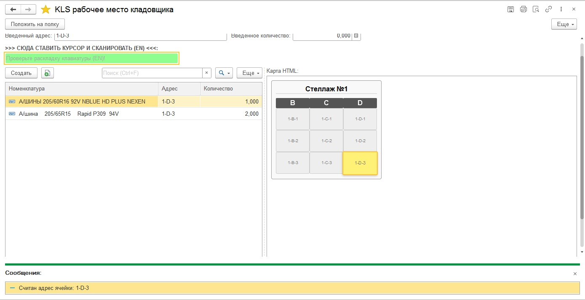
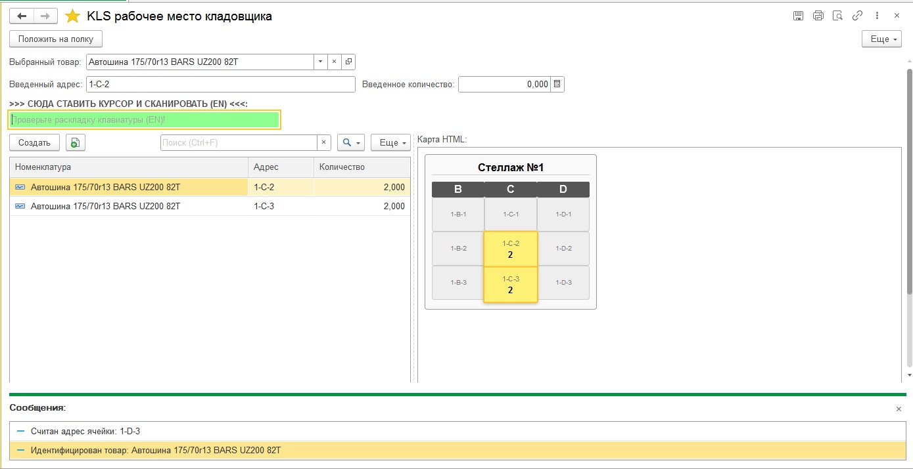

# 📦 KLS: Адресное хранение (Light WMS) для 1С:УТ 11

**Расширение конфигурации для организации простого динамического адресного хранения с визуализацией карты склада.**

Решение разработано для магазинов автозапчастей и шинных центров, чтобы упростить поиск товара и исключить зависимость от "незаменимых" сотрудников склада.

## 🔥 Основные возможности

*   **Визуальная карта склада:** Интерактивная схема стеллажей (HTML5 + CSS + JS), встроенная прямо в форму 1С.
    *   При выборе товара нужная ячейка **подсвечивается желтым**.
    *   Отображение остатков в ячейке прямо на схеме.
*   **Динамическая привязка:** Не требуется предварительное создание топологии склада. Связка "Товар ↔ Ячейка" создается по факту сканирования (Putaway).
*   **Работа с маркировкой:** Поддержка сканирования кодов DataMatrix (Честный Знак).
    *   Алгоритм автоматически извлекает GTIN (EAN-13) из длинной строки маркировки для поиска номенклатуры.
*   **Двунаправленный поиск:**
    *   *Где лежит товар?* (Скан товара → Подсветка ячейки).
    *   *Что лежит на полке?* (Скан ячейки → Список товаров).

---

## 📸 Скриншоты

### 1. Рабочее место кладовщика (Визуализация)

### 2. Подсветка ячейки при поиске

---

## 🛠 Техническая реализация

Проект реализован в виде **Расширения конфигурации (.cfe)**. Не требует снятия основной конфигурации с поддержки.

**Стек технологий:**
1.  **Хранение данных:** Собственный независимый Регистр сведений (`KLS_МестаХраненияШин`), добавленный через расширение.
2.  **Интерфейс:**
    *   Поле HTML документа для отрисовки карты.
    *   Взаимодействие `1C ↔ JS` через генерацию JSON и внедрение скриптов в DOM.
    *   Динамический список с программным управлением отборами.
3.  **Оборудование:**
    *   Интеграция с БПО (Библиотека Подключаемого Оборудования).
    *   Перехват событий сканера (`ОбработкаОповещения`).
    *   Обработка ввода от "клавиатурных" сканеров (перехват ввода в поле).

---

## 🚀 Установка

1.  Скачайте файл `KLS_Sklad_v1.cfe` из раздела Releases.
2.  В режиме "1С:Предприятие" перейдите: **НСИ и администрирование -> Печатные формы, отчеты и обработки -> Расширения**.
3.  Нажмите "Добавить из файла" и выберите скачанный файл.
4.  **Важно:** Снимите галочку **"Безопасный режим"** (необходимо для работы серверных методов и HTML).
5.  Перезапустите сеанс 1С.

## 📝 Использование

1.  Откройте обработку "АРМ Кладовщика" (Раздел "Склад").
2.  **Размещение:**
    *   Сканируйте товар (или выберите из списка).
    *   Сканируйте штрихкод полки (или введите адрес, например `1-B-2`).
    *   Нажмите "Записать".
3.  **Поиск:**
    *   Сканируйте товар — на карте загорится место хранения.

---
*Проект создан в учебных и практических целях для демонстрации возможностей интеграции веб-технологий в платформу 1С.*
